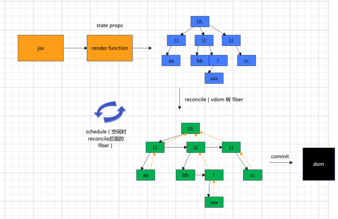
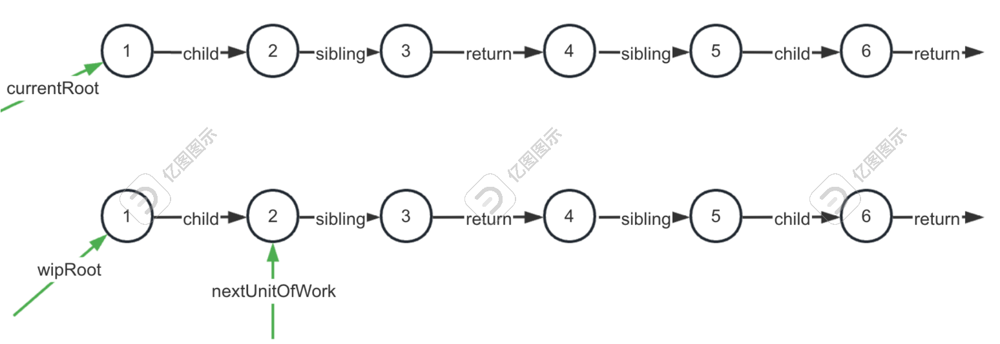

# React 通关掘金小册学习

echo "# learn-react-pass" >> README.md
git init
git add README.md
git commit -m "first commit"
git branch -M main
git remote add origin git@github.com:hxh-ly/learn-react-pass.git
git push -u origin main

## 06 受控组件

1. value 由用户控制就是非受控模式，由代码控制就是受控模式。不能用代码改变的，我们只是设置了一个 default 值，其他由用户控制-非受控模式
2. 代码可以改变表单的 value-受控模式

## 07 实现 calendar 组件

1.静态布局

header
flex 的格子

2.逻辑

- 日期属性，支持往前切换月份，支持往后切换月份
- 改变日期
- 增加 2 个参数 defaultValue 和 onChange
- 提供 ref 来暴露 calendar 的 api
- 添加两种模式的支持，使用 ahook

## 08 实现 calendar 组件（上）

- 用 dayjs
- 布局部分，切换日期的 header 和每个月的日期的 MonthCalendar
- sass 管理样式

## 09 实现 calendar 组件 （下）

- className + style
- dateRender + dateInnerContent
- locale
- value + onChange 【ahooks 会调用 onChange】

## 13 实现 Icon 组件（上）

- style className size spin Icon 封装
- createIcon
- createIconFromIconFont

## 14 实现 Space 组件

- direction、style、align、size、wrap、split、
- ConfigProvider 提供统一的 size

```tsx
interface SpaceProps extends React.HtmlAttributes<HtmlDivElement> {}
```

## 18 实现 WaterMark 组件

- 【style、className、width、height、zIndex、rotate、gap、offset】【getContainer】【fontStyle、image、content】
- WaterMark: getContainer useEffect->generateWark
- useWaterMark
- createWaterMark
- createCanvasData
- MutationObserver 在 UseWaterMark 中，容器存在的时候，先清，在创建开始监听元素以及属性，在监听。创建的 callback 的 onChange 时删除水印重绘

## 19 手写 react-lazy 组件

- 【style，height，width，offset，onVisible，playload】
- IntersectionObserver

## react-spring

- useSpringValue/useSpring/useSpring 函数重载/多个元素的动画 useSprings/动画依次 useTrail/useSpringRef 拿到动画的 ref/多个动画安排 useChain
- 实现笑脸动画
- part1 网格

```jsx
STROKE_WIDTH 0.5
x2 -> MAX_WIDTH 150
y2 -> MAX_HEIGHT 100

viewbox = 0 0 150 100

      <div className="container">
        <svg viewBox={`0 0 ${MAX_WIDTH} ${MAX_HEIGHT}`}>
          <g>
            {gridSprings.map(({ x2 }, index) => {
              return (
                <animated.line
                  x1={0}
                  y1={index * 10}
                  x2={x2}
                  y2={index * 10}
                  key={index}
                  strokeWidth={STROKE_WIDTH}
                  stroke="currentColor"
                />
              );
            })}

            {gridSprings.map(({ y2 }, index) => {
              return (
                <animated.line
                  x1={index * 10}
                  y1={0}
                  x2={index * 10}
                  y2={y2}
                  key={index}
                  strokeWidth={STROKE_WIDTH}
                  stroke="currentColor"
                />
              );
            })}
          </g>
        </svg>
      </div>
```

- part2 笑脸

```jsx
COORDS = [
    [50,30],
    [90,30],
    [50,50],
    [60,60],
    [70,60],
    [80,60],
    [90,50]
]
const boxApi = useSpringRef()
const [boxSprings] = useSprings(7,(i)=>{
    return {
        ref:boxApi,
        from:{scale:0},
        to:{scale:0},
        delay:i*200,
        config:{
            mass:,
            tension:,
        },
    }
})

useChain([gridRef,boxApi],[0,1],1500)

<svg>

    {
        boxSprings.map(({scale},i)=>{
            return <animated.rect  key={i} width={10} height={10} style={{
                transfrom: `translate(${COORDS[i][0]}px,${COORDS[i][1]}px)`
                transfromOrigin:'5px 5px',
                scale
            }}/>
        })
    }
</svg>
```

## 24 动画结合手势

```jsx
npm i @react-spring/web @use-gesture/react -D

const pages = [
  'https://images.pexels.com/photos/62689/pexels-photo-62689.jpeg?auto=compress&cs=tinysrgb&dpr=2&h=750&w=1260',
  'https://images.pexels.com/photos/733853/pexels-photo-733853.jpeg?auto=compress&cs=tinysrgb&dpr=2&h=750&w=1260',
  'https://images.pexels.com/photos/4016596/pexels-photo-4016596.jpeg?auto=compress&cs=tinysrgb&dpr=2&h=750&w=1260',
  'https://images.pexels.com/photos/351265/pexels-photo-351265.jpeg?auto=compress&cs=tinysrgb&dpr=2&h=750&w=1260',
  'https://images.pexels.com/photos/924675/pexels-photo-924675.jpeg?auto=compress&cs=tinysrgb&dpr=2&h=750&w=1260',
]

function Viewpager(){
  const width = window.innerWidth;
  const [props,api] = useSprings(pages.length,(v,i)=>{
    return {
      x:i*width,
      scale:1
    }
  })

  return <>
  {props.map(({x,scale},i)=>{
    return <div className='wrapper'>
      <animated.div key={i} style={{x}} className='page'>
        <animated.div  style={{scale, backgroundImage:`url(${pages[i]})` }} />
      </animated.div>
    </div>
  })}
  </>
}

export default Viewpager
```

## 26 tailwindcss 原子化的 css 框架

安装

```
npm install tailwindcss @tailwindcss/vite -D

App.css
@import "tailwindcss";
```

### 介绍

tailwindcsss 是一个流行的原子化 css 框架。传统的 css 写法是定义 class，然后在 class 内部写样式。而原子化 css 是通过预定义一些 class 样式，通过组合 class 完成样式的编写。
预设的的 class 可以通过配置文件修改值，
使用

- text-[14px]
- @layer aaa
- @apply

module.css 使用

- className 会 ➕hash，可以通过 vite.config.js generateScopedName 配置
- :global(.class) 是全局；使用直接用类名
- :local(.class) 是局部；与全局相反
- globalModulePaths 匹配全局的 module.css
- localsConvention 导出的对象的 key 就会变成驼峰的
- scopeBehaviour:'global'
  总结: module.css 用来防止样式冲突，bem 是从规范上限制不可靠。module.css 是从编译上避免命名冲突。组件开发都有模块化的需求

## 30 Message 组件的开发

- useStore msgList add remove clear update
- useTimer
- MessageProvider
- MessageItem
- 添加动画 react-transition-group csstransitiongroup 包裹 + csstransition 包裹子项 class 实现 enter+exit
- message.info
- MessageProvider + forWardRef + useImperative
- ContextProvder.tsx 里创建 context 暴露，返回 Context.Provider
- useMessage 使用 context 中的 ref 元素
- ConfigContext.Provider (MessageProvider 放出去，接在 context 里)
- 在 Aaa 组件里使用 useMessage
- useImperative 的是某个时机，才修改的。 我们是先执行了 useMessage ，在设置的 MessageRef.current

## 31popover 气泡卡片的开发

- 计算浮动位置 float-ui npm install @floating-ui/react -D
- 了解 hooks useFloating useHover useInteractions
- - useDiss useFloating 配置 offset、placement、 <FloatArrow></FloatArrow>
- 边界处理，如果出现在上方，滚动到不可视，应该变到下方 flip 中间件
- 封装 props {content,open,openChange,placement,trigger,className,style }
- createPortal 挂在 body 下

## 32 项目里如何快速定位组件源码

- npm i click-to-react-component
- 原理，\_reactFiber -> debugFiber(可以层层找到父 filber) ，\_debuggerSource(定位源码行列号位置)
- ui 实现，定义框选样式，target 是个 state，设置 dataset 属性，mousemove 改变 target，从而获取 [data-xx]的样式。
- ui 实现，popover 是通过 @floating-ui 实现的

## 35colorPicker 颜色选择器组件

- 布局 colorPickerPanel + colorInput ✅
- colorPickerPanel = Palette ✅ + Slider
- type color ✅
- Palette 组件的实现 ✅
- Handler 组件的实现 ✅
- Transform 组件的实现 ✅
- 实现拖拽的 useColorDrag.ts ✅
- 根据 x,y 去算颜色 utils.ts ✅
- 初始化颜色不对，最开始也要计算一次滑块位置 ✅
- 支持受控和非受控组件 ✅
- 色展示 input （h l） ✅

## 36 实现 Onboard 组件（tour 组件）

- div 的 width+height+四边 boardWidth
- 实现 mask 移动的动画，改变 boardWidth+transition
- 外层封装一层，加上上一步下一步的切换
  注意：

## 52 实现 todo list

1.拖拽插入（高亮）

2.拖出删除（垃圾桶高亮）

3.chekbox 勾选

实现步骤

### 安装

```
npx create-vite
npm install -D tailwindcss postcss autoprefixer

npx tailwindcss init -p
```

新建 TodoList/index.tsx

```tsx
import { FC } from "react";
interface ToDoListProps {}
export const ToDoList: FC<TodoListProps> = (props) => {
  return <div></div>;
};
```

安装 tailWind，并配置

设置 ToDoList/index.tsx 的基本样式,并在`App.tsx`引入

```tsx
import { FC } from "react";
interface ToDoListProps {}
export const ToDoList: FC<TodoListProps> = (props) => {
  return <div className="w-1000 h-600 m-auto mt-10 p-10 border-2-black"></div>;
};
```

因为像 w-100 这样的样式内置的 className 没有，需要在 tailwind.config.js 里配置(此处配置无效，后使用类似 `w-[1000px]`解决

继续写布局

```tsx
export const ToDoList: FC<TodoListProps> = (props) => {
  return (
    <div className="w-1000 h-600 m-auto mt-10 p-10 border-2-black flex justify-between items-start">
      <div className="flex-2 h-full mr-[10px] bg-blue-400 overflow-auto"></div>
      <div className="flex-1 h-full bg-blue-400"></div>
    </div>
  );
};
```

父元素 flex，子元素 2 比 1，margin-right:10px h-full 是高 100%

继续添加组件 List、GarbageBin、NewItem 三个组件

```tsx
import { FC } from "react";
import { NewItem } from "./NewItem";
import { GarbageBin } from "./GarbageBin";
import { List } from "./List";
import classNames from "classnames";
interface TodoListProps {}

export const TodoList: FC<TodoListProps> = (props) => {
  return (
    <div
      className={classNames(
        "w-[1000px] h-[600px] m-auto mt-10 p-10",
        "border-2-black",
        "flex justify-between items-start"
      )}
    >
      <div className="flex-2 h-full mr-[10px] bg-blue-400 overflow-auto">
        <List></List>
      </div>
      <div
        className={classNames("flex-1 h-full', 'flex flex-col justify-start")}
      >
        <NewItem></NewItem>
        <GarbageBin className="mt-100"></GarbageBin>
      </div>
    </div>
  );
};
```

多行 className 使用`classNames`分

继续添加 GarbageBin.tsx

```tsx
import classNames from "classnames";
interface GarbageBinProps {
  className: string | string[];
}
export function GarbageBin(props: GarbageBinProps) {
  const cs = classNames("h-100 b-2-black", props.className);
  return <div className={cs}></div>;
}
```

继续添加 newItem.tsx

```tsx
import classNames from "classnames";
import { FC } from "react";

interface NewItemProps {
  className?: string | string[];
}

export const NewItem: FC<NewItemProps> = (props) => {
  const cs = classNames(
    "h-[200px] border-2 border-black",
    "bg-green-300",
    props.className
  );

  return <div className={cs}></div>;
};
```

List.tsx

```tsx
import classNames from "classnames";
import { FC } from "react";

interface ListProps {
  className?: string | string[];
}

export const List: FC<ListProps> = (props) => {
  const cs = classNames("h-full border-2 border-black", props.className);

  return <div className={cs}></div>;
};
```

继续实现 List

```tsx
export const List: FC<ListProps> = (props) => {
  const cs = classNames("h-full", props.className);

  return (
    <div className={cs}>
      <Item></Item>
      <Item></Item>
      <Item></Item>
    </div>
  );
};

function Item() {
  return (
    <div
      className={classNames(
        "h-[100px] border-2 border-black bg-blue-300 mb-[10px] p-[10px]",
        "flex justify-start items-center",
        "text-xl tracking-wide"
      )}
    >
      <input type="checkbox" className="w-[40px] h-[40px] mr-[10px]" />
      <p>待办事项</p>
    </div>
  );
}
```

继续 GarbageBin

```tsx
import classNames from "classnames";
interface GarbageBinProps {
  className: string | string[];
}
export function GarbageBin(props: GarbageBinProps) {
  const cs = classNames(
    "h-[100px] border-2 border-black",
    "bg-orange-300",
    "leading-200 text-center text-2xl",
    "cursor-move select-none",
    props.className
  );
  return <div className={cs}>垃圾箱</div>;
}
```

添加 react-dnd 来做拖拽

```cmd
npm install react-dnd react-dnd-html5-backend
```

main.tsx 引入 DndProvider

```tsx
import { createRoot } from "react-dom/client";
import App from "./App.tsx";
import { DndProvider } from "react-dnd";
// @ts-ignore
import { ClickToComponent } from "click-to-react-component";
import { HTML5Backend } from "react-dnd-html5-backend";
createRoot(document.getElementById("root")!).render(
  <>
    <ClickToComponent />
    <DndProvider backend={HTML5Backend}>
      <App />
    </DndProvider>
  </>
```

NewItem.tsx 使用 useDrag

```tsx
import classNames from "classnames";
import { FC, useEffect, useRef } from "react";
import { useDrag } from "react-dnd";

interface NewItemProps {
  className?: string | string[];
}

export const NewItem: FC<NewItemProps> = (props) => {
  const [{ isDragging }, drag] = useDrag({
    type: "new-item",
    collect(monitor) {
      return {
        isDragging: monitor.isDragging(),
      };
    },
  });
  const ref = useRef(null);
  const cs = classNames(
    "h-[100px] border-2 border-black",
    "leading-100 text-center text-2xl",
    "bg-green-300",
    "cursor-move select-none",
    isDragging ? "border-dashed bg-white" : "",
    props.className
  );
  useEffect(() => {
    drag(ref);
  }, []);
  return (
    <div ref={ref} className={cs}>
      新的待办事项
    </div>
  );
};
```

List 的 Item 也添加 drag

```tsx
function Item() {
  const ref = useRef(null);
  const [{ isDragging }, drag] = useDrag({
    type: "list-item",
    collect(monitor) {
      return { isDragging: monitor.isDragging() };
    },
  });
  useEffect(() => {
    drag(ref);
  }, []);
  return (
    <div
      className={classNames(
        "h-[100px] border-2 border-black bg-blue-300 mb-[10px] p-[10px]",
        "flex justify-start items-center",
        "text-xl tracking-wide",
        isDragging ? "bg-white border-dashed" : ""
      )}
      ref={ref}
    >
      <input type="checkbox" className="w-[40px] h-[40px] mr-[10px]" />
      <p>待办事项</p>
    </div>
  );
}
```

垃圾箱添加 useDrop

```tsx
export function GarbageBin(props: GarbageBinProps) {
  const ref = useRef(null);
  const [{ isOver }, drop] = useDrop(() => ({
    accept: "list-item",
    drop(item) {},
    collect(monitor) {
      return {
        isOver: monitor.isOver(),
      };
    },
  }));
  useEffect(() => {
    drop(ref);
  }, []);
  const cs = classNames(
    "h-[200px] border-2 border-black",
    "bg-orange-300",
    "leading-[200px] text-center text-2xl",
    "cursor-move select-none",
    isOver ? "bg-yellow-400 border-dashed" : "",
    props.className
  );
  return (
    <div ref={ref} className={cs}>
      垃圾箱
    </div>
  );
}
```

更新的 item 拖拽到 gap
[text](https://p1-juejin.byteimg.com/tos-cn-i-k3u1fbpfcp/5510f73bb0454c99aaa847abce813b40~tplv-k3u1fbpfcp-jj-mark%3A0%3A0%3A0%3A0%3Aq75.image#%3Fw%3D1268%26h%3D1170%26s%3D64789%26e%3Dpng%26b%3D9dc4f8)

Gap 组件

```tsx
function Gap() {
  const ref = useRef(null);
  const [{ isOver }, drop] = useDrop(() => ({
    accept: "new-item",
    drop(item) {},
    collect(monitor) {
      return {
        isOver: monitor.isOver(),
      };
    },
  }));
  useEffect(() => {
    drop(ref);
  }, []);
  const cs = classNames("h-[10px]", isOver ? "bg-red-300" : "");
  return <div ref={ref} className={cs}></div>;
}
```

接下来处理逻辑 zustand
安装 zustand

```cmd
npm install zustand --save
```

创建 TodoList/Store.ts

```tsx
import { create } from "zustand";
interface ListItem {
  id: string;
  content: string;
  status: "done" | "todo";
}
type State = {
  list: ListItem[];
};
type Action = {
  addItem(item: ListItem): void;
  delItem(id: string): void;
  updateItem(item: ListItem): void;
};

export const ListStore = create<State & Action>((set) => ({
  list: [],
  addItem: (item: ListItem) => {
    set((state) => {
      return {
        list: [...state.list, item],
      };
    });
  },
  delItem: (id: string) => {
    set((state) => {
      return {
        list: state.list.filter((v) => v.id !== id),
      };
    });
  },
  updateItem: (item: ListItem) => {
    set((state) => {
      return {
        list: state.list.map((v) => (v.id === item.id ? item : v)),
      };
    });
  },
}));
```

List 里使用

```tsx
import classNames from "classnames";
import { FC, Fragment, useEffect, useRef } from "react";
import { useDrag, useDrop } from "react-dnd";
import { Item } from "./Item";
import { Gap } from "./Gap";
import { useTodoListStore } from "./Store";
interface ListProps {
  className?: string | string[];
}

export const List: FC<ListProps> = (props) => {
  const list = useTodoListStore((state) => state.list);
  const cs = classNames("h-full ", props.className);

  return (
    <div className={cs}>
      {list.length
        ? list.map((v) => (
            <Fragment key={v.id}>
              <Gap></Gap>
              <Item data={v}></Item>
            </Fragment>
          ))
        : "暂无待办事项"}
      <Gap></Gap>
    </div>
  );
};
```

item 添加 data 属性

gap 添加 store 到 addItem 方法

```tsx
import classNames from "classnames";
import { useEffect, useRef } from "react";
import { useDrag, useDrop } from "react-dnd";
import { useTodoListStore } from "./Store";
export function Gap() {
  const addItem = useTodoListStore((state) => state.addItem);
  const ref = useRef(null);
  const [{ isOver }, drop] = useDrop(() => ({
    accept: "new-item",
    drop(item) {
      addItem({
        id: Math.random().toString().slice(2, 8),
        status: "todo",
        content: "待办事项",
      });
    },
    collect(monitor) {
      return {
        isOver: monitor.isOver(),
      };
    },
  }));
  useEffect(() => {
    drop(ref);
  }, []);
  const cs = classNames("h-[10px]", isOver ? "bg-red-300" : "");
  return <div ref={ref} className={cs}></div>;
}
```

删除功能 Item
Item

```tsx
export function Item(props: ItemProps) {
  const [{ isDragging }, drag] = useDrag({
    item() {
      return {
        id: data.id,
      };
    },
  });
}
```

GarbageBin 的 delItem

```tsx
export function GarbageBin(props: GarbageBinProps) {
  const delItem = useTodoListStore((state) => state.delItem);
  const [{ isOver }, drop] = useDrop(() => ({
    drop(item: ListItem) {
      delItem(item.id);
    },
  }));
}
```

编辑功能 Item.tsx
content + status

```tsx
import classNames from "classnames";
import { useEffect, useRef, useState } from "react";
import { useDrag } from "react-dnd";
import { ListItem, useTodoListStore } from "./Store";
interface ItemProps {
  data: ListItem;
}
export function Item(props: ItemProps) {
  const [isEdit, setIsEdit] = useState(false);
  const [editContent, setEditContent] = useState(data.content);
  const updateItem = useTodoListStore((state) => state.updateItem);
  return (
    <div onDoubleClick={() => setIsEdit(true)}>
      <input
        type="checkbox"
        checked={data.status === "done"}
        onChange={(e) => {
          updateItem({
            id: data.id,
            content: data.content,
            status: e.target.checked ? "done" : "todo",
          });
        }}
      />
      <p>
        {isEdit ? (
          <input
            className="w-140 h-20"
            onChange={(e) => {
              setEditContent(e.target.value);
            }}
            value={editContent}
            onBlur={(e) => {
              setIsEdit(false);
              updateItem({
                id: data.id,
                content: editContent,
                status: data.status,
              });
            }}
          ></input>
        ) : (
          data.content
        )}
      </p>
    </div>
  );
}
```

拖拽插入的顺序优化
gap + id (id 可能为空)
addItem(item,id)

zustand 加上 persist 插件

```tsx
const stateCreateor: StateCreator<State & Action> = (set) => ({});
export const useTodoListStore = create<State & Action>()(
  persist(stateCreateor, {
    name: "todoList",
  })
);
```

+拖拽排序

+动画 react-spring

```tsx
npm install --save @react-spring/web
```

todoList

```tsx
export const List: FC<ListProps> = (props) => {
  const transitions = useTransition(list, {
    from: { transform: "translate3d(-100%,0,0)", opacity: 0 },
    enter: { transform: "translate3d(0%,0,0)", opacity: 1 },
    leave: { transform: "translate3d(100%,0,0)", opacity: 0 },
    keys: list.map((v) => v.id), // key放在这了
  });
  return (
    <div className={cs}>
      {list.length
        ? transitions((style, v) => (
            <animated.div style={style}>
              <Gap id={v.id}></Gap>
              <Item data={v}></Item>
            </animated.div>
          ))
        : "暂无待办事项"}
      <Gap id={""}></Gap>
    </div>
  );
};
```

## 53.ReactPlayground 项目实战

需求：左边写代码，右边可以实时预览，右边可以看到编译后的代码
实现思路：
首先是编译，@babel/standalone,babel 的浏览器版本，可以见 tsx 编译成 js
安装

```cmd
npm i --save @babel/standalone
npm i --save-dev @types/babel_standalone
```

体验

```tsx
export function TestBabel() {
  const textAreaRef = useRef(null);

  const code = `import { useEffect, useState } from "react";

  function App() {
    const [num, setNum] = useState(() => {
      const num1 = 1 + 2;
      const num2 = 2 + 3;
      return num1 + num2
    });
  
    return (
      <div onClick={() => setNum((prevNum) => prevNum + 1)}>{num}</div>
    );
  }
  
  export default App;
    `;
  const compile = () => {
    if (!textAreaRef.current) {
      return;
    }
    const res = transform(textAreaRef.current.value, {
      presets: ["react", "typescript"],
      filename: "guang.tsx",
    });
    console.log(res.code);
  };
  return (
    <>
      <textarea
        ref={textAreaRef}
        style={{ width: "500px", height: "300px" }}
        defaultValue={code}
      ></textarea>
      <button onClick={compile}>编译</button>
    </>
  );
}
```

但编译的代码不能跑，主要是 import 语句这里，我们可以把一段 JS 代码，用 URL.createObjectUrl(new Blob(code,{type:'application/javascript'}))

所以如何编译呢，我们维护 App.tsx 通过 URL.createObjectUrl 变为一个 blob url,替换 import 的路径，使用 babel 插件。

babel 编译的阶段 `parse`/`transform`/`generate`
只要在对 Importdeclaration 的 AST 做处理，把 source.value 替换为对应文件的 blob url 就行了

比如这样写

```tsx
function App() {
  const code1 = `function add(a, b) {
        return a + b;
    }
    export { add };`;
  const url = URL.createObjectURL(
    new Blob(code1, { type: "application/javascript" })
  );
  const code = `import {add} from './add.ts';console.log(add)`;
  const transformImportSourcePlugin: PluginObject = {
    visitor: {
      ImportDeclaration(path) {
        path.node.source.value = url;
      },
    },
  };
  function onClick() {
    const res = transform(code, {
      persets: ["react", "typescript"],
      fileName: "guang.ts",
      plugins: [transformImportSourcePlugin],
    });
    console.log(res.code);
  }
  return (
    <div>
      <button onClick={onClick}>编译</button>
    </div>
  );
}
export default App;
```

这里用 babel 插件的方式对 import 的 source 做替换，用到的`npm i --save-dev @types/babel__core`,把 ImportDeclaration 的 source 的值改为 blob url

下一个问题：如果引入的是 react 和 react-dom 的包，这些也不是在左侧写的代码，这时候可以用 import maps 的机制

```html
<script type="importmap">
  {
    "imports": {
      "react": "https://esm.sh/react@18.2.0"
    }
  }
</script>
<script type="module">
  import React from "react";
  console.log(React);
</script>
```

编辑器部分怎么做？
安装 `npm install @monaco-editor/react`
体验

```tsx
export function testEditor() {
  const code = `import { useEffect, useState } from "react";

function App() {
    const [num, setNum] = useState(() => {
        const num1 = 1 + 2;
        const num2 = 2 + 3;
        return num1 + num2
    });

    return (
        <div onClick={() => setNum((prevNum) => prevNum + 1)}>{num}</div>
    );
}

export default App;
`;
  return (
    <Editor
      height="500px"
      defaultLanguage="javascript"
      defaultValue={code}
    ></Editor>
  );
}
```

预览部分，iframe，加通讯机制，左边编辑器的结果，编译后传递到 iframe 渲染

```tsx
import React from "react";
import iframeRaw from "./iframe.html?raw";
const iframeUrl = URL.createObjectURL(
  new Blob[(iframeRaw, { type: "text/html" })]()
);
const Preview = () => {
  return (
    <>
      <iframe
        src={iframeUrl}
        style={{ height: "100%", width: "100%", padding: 0, border: "none" }}
      ></iframe>
    </>
  );
};
export default Preview;
```

```html
<!DOCTYPE html>
<html lang="en">
  <head>
    <meta charset="UTF-8" />
    <meta name="viewport" content="width=device-width, initial-scale=1.0" />
    <title>Preview</title>
    <style>
      * {
        padding: 0;
        margin: 0;
      }
    </style>
  </head>
  <body>
    <script type="importmap">
      {
        "imports": {
          "react": "https://esm.sh/react@18.2.0",
          "react-dom/client": "https://esm.sh/react-dom@18.2.0"
        }
      }
    </script>
    <script></script>
    <script type="module">
      import React, { useState, useEffect } from "react";
      import ReactDOM from "react-dom/client";

      const App = () => {
        return React.createElement("div", null, "aaa");
      };

      window.addEventListener("load", () => {
        const root = document.getElementById("root");
        ReactDOM.createRoot(root).render(React.createElement(App, null));
      });
    </script>

    <div id="root">
      <div
        style="position:absolute;top: 0;left:0;width:100%;height:100%;display: flex;justify-content: center;align-items: center;"
      >
        Loading...
      </div>
    </div>
  </body>
</html>
```

### 总结

分析 playground 的实现思路
import
import maps
编辑器
iframe

## 54.ReactPlayground 布局、代码编辑器

布局可拖拽
`npm install --save allotment`

代码编辑器

- 传入`EditorFile{name,value,language}`
- Editor 的 onMount 处理 jsx 提示处理 +cmd 处理+ts 提示+ata 自动下载
- EditorProps{file,onChange,options}
- Editor 的样式 options[预览图、滚动条]
- 根据内容下载对应包的.d.ts 文件 `npm install --save @typescript/ata -f`

## 55.ReactPlayground 多文件切换

要实现多文件切换，右侧 preview 也要拿到数据，如何实现多文件共享数据，要用到 context
PlaygroundContext.ts

```ts
interface File {
  name:string,
  value:string,
  language:string
}
export interface Files {
  [key:string]:File
}
interface PlaygroundContextProps {
  files:Files，
  selectedFiles:string,
  setSelectedFileName:(f:string)=>void,
  setFile:(f:File)=>void,
  addFile:(f:string)=>void，
  removeFile:(f:string)=>void,
  updateFileName:(oldF:string,newF:string)=>void
}

export const context = createContext<PlaygroundContextProps>({
selectedFiles:'App.tsx'
} as PlaygroundContextProps)
```

提供一个 PlaygroundProvider

- 设计 props value = {Files,selectedFile,setFiles,setSelectedFile,addFile,removeFile,updateFile }
- mock 文件 files 作为 provider 的初始值
- 设计 tab 切换，样式,+优化横向滚动条
- 实现 fileName2language
- 更改文件内容时需要在 editChange 更新 Files + lodash `npm install --save lodash-es  npm install --save-dev @types/lodash-es`

## 56.ReactPlayground 的 babel 编译、iframe 预览

左边编辑，右边编译和预览

使用 babel 的 transform 进行编译

```ts
// Preview/compiler.ts
import {transform} from '@babel/standalone'
export const babelTransform = (filename:string,code:string,file:File) {
  let result = '';
  try{
   result = transform(code,{
    presets:['react','typescript'],
    fileName,
    plugins:[],
    retainLines:true
  }).code!
  } catch (e) {
    console.error('compiler error',e)
  }
}
```

在 Perview 引入使用

```tsx
const { files } = useContext(PlaygroundContext);

const [compilerCode, setCompilerCode] = useState("");
useEffect(() => {
  console.log(["preview"]);
  const c = compiler(files);
  setCompilerCode(c);
}, [files]);
return (
  <div style={{ height: "100%" }}>
    <EditorView
      file={{ name: "dist.js", value: compilerCode, language: "javascript" }}
    ></EditorView>
  </div>
);
```

需要知道

- `Perview`组件要实现 1.渲染 iframe，iframe 的地址是 state 变更，getIframeUrl；2.compileCode 是 state 变更；3.需要实现 compile(files,path)
- import React 通过 importmap 实现
- import ‘./App.tsx'通过 transform 的时候，添加 plugins 控件修改 `path.node.source.value`实现修改引入，
- import ’./App'需要通过 transform(path,code,files)实现转化 jsx 为 createElement
- import './App.css'通过执行一段立即执行函数，实现函数`css2js`
- import './import-map.json'修改成`import default ${file.name}` 实现函数`json2js`
- custPlugin 在 babelTransform 里， custPlugin 会解析`jsx/tsx`会递归 babelTransform
- beforeTransfrom 对没有引入 React 进行处理，需要前置处理

## 57.实现文件的增删改

fileItem 实现双击切换编辑

```tsx
export function FileNameItem(props: FileNameItemProps) {
  const { onEditComplete } = props;

  const [isEdit, setIsEdit] = useState(create);
  const inputRef = useRef(null);

  const handleDoubleClick = (e) => {
    setIsEdit(true);
    setTimeout(() => {
      inputRef.current?.focus();
    });
  };

  return (
    <div className={cs} onClick={onClick}>
      {isEdit ? (
        <div>
          <input
            ref={inputRef}
            className={styles["tabs-item-input"]}
            onChange={(e) => {
              setName(e.target.value);
            }}
            onBlur={(e) => {
              setIsEdit(false);
              onEditComplete(name);
            }}
          ></input>
        </div>
      ) : (
        <>
          <span onDoubleClick={handleDoubleClick}>{name}</span>
        </>
      )}
    </div>
  );
}

// FileList.tsx
<FileNameItem
  onEditComplete={(newFile) => {
    console.log(v, newFile);
    updateFileName(v, newFile);
    setSelectedFileName(newFile);
  }}
></FileNameItem>;
```

添加

```tsx
const addTab = () => {
  const name = "Comp" + Math.random().toString().slice(2, 8) + ".tsx";
  addFile(name);
  setSelectedFileName(name);
  setCreate(true);
};

<FileNameItem
  onEditComplete={(newFile) => {
    console.log(v, newFile);
    updateFileName(v, newFile);
    setSelectedFileName(newFile);
    setCreate(false);
  }}
></FileNameItem>;

// FileItem.tsx
export function FileNameItem(props: FileNameItemProps) {
  const {
    value,
    active = false,
    create,
    readonly,
    onClick,
    onEditComplete,
    onRemove,
  } = props;
  const [name, setName] = useState(value);
  const [isEdit, setIsEdit] = useState(create);
  useEffect(() => {
    if (create) {
      inputRef.current?.focus();
    }
  }, [create]);
  return (
    <div className={cs} onClick={onClick}>
      {isEdit ? (
        <div>
          <input
            ref={inputRef}
            value={name}
            className={styles["tabs-item-input"]}
            onChange={(e) => {
              setName(e.target.value);
            }}
            onBlur={(e) => {
              setIsEdit(false);
              onEditComplete(name);
            }}
          ></input>
        </div>
      ) : (
        <>
          <span onDoubleClick={handleDoubleClick}>{name}</span>
        </>
      )}
    </div>
  );
}
```

删除

```tsx
// FileList.tsx
    <FileNameItem
              readonly={READ_ONLY.includes(v)}
              active={v === selectedFiles}
              onRemove={(e) => {
                e.stopPropagation();
                removeFile(v);
                setSelectedFileName(ENTRY_FILE_NAME);
              }}></FileNameItem>

// FileItem.tsx
export function FileNameItem(props: FileNameItemProps) {
  const {
    readonly,
    onRemove,
  } = props;
  return (
    <div
      {isEdit ? (
        <div>
          <input
          ></input>
        </div>
      ) : (
        <>
          <span onDoubleClick={readonly?()=>{}:handleDoubleClick}>{name}</span>

          {!readonly&&<span style={{ marginLeft: 5, display: "flex" }} onClick={onRemove}>
            <svg width="12" height="12" viewBox="0 0 24 24">
              <line stroke="#999" x1="18" y1="6" x2="6" y2="18"></line>
              <line stroke="#999" x1="6" y1="6" x2="18" y2="18"></line>
            </svg>
          </span>}
        </>
      )}
    </div>
  );
}
```

## 58.ReactPlayground 项目实战：错误显示、主题切换

- iframe 预览失败，显示
- 依赖引入失败，提示

新增 Message.tsx

```tsx
interface MessageProps {
  type: "error" | "warning";
  content: string;
}
export const Message = (props: MessageProps) => {
  const { type, content } = props;
  const [isVisible, setIsVisible] = useState(false);
  useEffect(() => {
    setIsVisible(!!content);
  }, [content]);
  return (
    <>
      {isVisible ? (
        <div className={classNames(style.msg, style[type])}>
          <pre dangerouslySetInnerHTML={{ __html: content }}></pre>
          <button
            className={classNames(style.dismiss)}
            onClick={() => setIsVisible(false)}
          >
            x
          </button>
        </div>
      ) : (
        ""
      )}
    </>
  );
};
```

```scss
.msg {
  position: absolute;
  right: 8px;
  bottom: 0;
  left: 8px;
  z-index: 10;

  display: flex;
  max-height: calc(100% - 300px);
  min-height: 40px;
  margin-bottom: 8px;
  color: var(--color);

  background-color: var(--bg-color);
  border: 2px solid #fff;
  border-radius: 6px;

  border-color: var(--color);

  &.error {
    --color: #f56c6c;
    --bg-color: #fef0f0;
  }

  &.warn {
    --color: #e6a23c;
    --bg-color: #fdf6ec;
  }
}

pre {
  padding: 12px 20px;
  margin: 0;
  overflow: auto;
  white-space: break-spaces;
}

.dismiss {
  position: absolute;
  top: 2px;
  right: 2px;

  display: block;
  width: 18px;
  height: 18px;
  padding: 0;

  font-size: 9px;
  line-height: 18px;
  color: var(--bg-color);

  text-align: center;
  cursor: pointer;
  background-color: var(--color);
  border: none;
  border-radius: 9px;
}
```

错误内容从何而来 iframe 里传出来

```html
<script>
  window.addEventListener("error", (e) => {
    window.parent.postMessage({ type: "ERROR", message: e.message });
  });
</script>
```

preview 监听错误

```tsx
// Preview.ets
useEffect(() => {
  window.addEventListener("message", handleMessage);
  return () => {
    window.removeEventListener("message", handleMessage);
  };
}, []);
```

主题切换
context 声明添加，provider 实现，index.tsx 引入初始化

```tsx
theme, setTheme;
```

scss 中

```
.light {
    --text: #444;
    --bg: #fff;
}
.dark {
    --text: #fff;
    --bg: #1a1a1a;
}
// 其他地方
background:var(--bg)
color:var(--text)
```

header 添加切换按钮

```tsx
<div>
  {theme === "light" && (
    <MoonOutlined
      className={styles[theme]}
      title="切换暗示主题"
      onClick={() => setTheme("dark")}
    ></MoonOutlined>
  )}
  {theme === "dark" && (
    <SunOutlined
      title="切换亮色主题"
      className={styles[theme]}
      onClick={() => setTheme("light")}
    ></SunOutlined>
  )}
</div>
```

编辑器的黑白样式

```tsx
<Editor options={{ theme: `vs-${theme}` }}></Editor>
```

## 59.ReactPlayground 文件分享

原理：
点击分享，把文件转成 hash，加到粘贴板上。
初始化从 url 的 hash 上拿下来进行初始化
文件太大需要压缩 ，使用`npm i --save fflate`

```ts
// 压缩方法
const compress = (code: string) => {
  const buffer = strToU8(code);
  const zipped = zlibSync(buffer, { level: 9 });
  const str = strFromU8(zipped, true); // 二进制字符串
  return btoa(str); // 二进制字符串转ascii
};

const uncompress = (base64: string) => {
  const binary = atob(base64); // 二进制字符串
  const buffer = strToU8(binary, true);
  const upzipped = unzlibSync(buffer);
  return strFromU8(upzipped);
};
```

```tsx
// PlaygroundProvider.tsx
useEffect(() => {
  const hash = compress(JSON.stringify(files));
  window.location.hash = hash;
}, [files]);
```

```tsx
// PlaygroundProvider.tsx 初始化
function getFileFromUrl() {
  const hash = window.location.hash.slice(1);
  let files;
  try {
    const str = uncompress(hash);
    files = JSON.parse(str);
  } catch (e) {}
  return files;
}
const [files, setFiles] = useState(getFileFromUrl() || initFiles);
```

Header 里加个按钮

```tsx
import copy from 'copy-to-clipboard'
console.log(styles);
export function Header() {
  const { theme, setTheme } = useContext(PlaygroundContext);
  return (
    <div className={styles.header} style={{ borderBottom: "1px solid #000" }}>
      <div className={styles.logo}>
        </img>
        <span>React Playground</span>
      </div>
      <div>{theme === "light" && <MoonOutlined className={styles[theme]} title="切换暗示主题" onClick={()=>setTheme('dark')}></MoonOutlined>}
        {theme === "dark" && <SunOutlined title="切换亮色主题" className={styles[theme]}  onClick={()=>setTheme('light')}></SunOutlined>}
      </div>
      <ShareAltOutlined onClick={()=>{
        copy(window.location.href);
        message.success('复制成功')
      }}></ShareAltOutlined>
    </div>
  );
```

实现文件下载功能

- 实现打包成 zip `npm install --save jszip`
- 触发代码下载`file-saver` `npm install --save file-saver npm install --save-dev @types/file-saver`

```ts
//utils.ts
async function downFiles(files: Files) {
  const zip = new JSzip();
  Object.keys(files).forEach((key) => {
    zip.file(key, files[key].value);
  });
  const blob = await zip.generateAsync({ type: "blob" });
  saveAs(blob, `code.zip`);
}
```

## 60 Playground 实战 使用 webworker 优化

这节我们做下性能优化

performance 发现有 long task，性能优化的目标是消除 long task.

怎么实现？

worker 的用法，文件名字改为 compiler.worker.ts,

在 Perview 组件中`import worker from 'compiler.worker?worker'`导入

```tsx
import CompilerWorker from "./worker.compiler?worker";

const compilerWokrerRef = useRef<Worker>();
useEffect(() => {
  if (!compilerWorkerRef.current) {
    compilerWorkerRef.current = new CompilerWorker();
    compilerWorkerRef.current.addEventListener("message", (e) => {
      if (data.type === "COMPILED_CODE") {
        setCompilerCode(data.data);
      } else {
        console.log("error", data.data);
      }
    });
  }
}, []);

useEffect(
  debounce(() => {
    console.log(["debounce post to worker"]);
    /* const c = compiler(files);
    setCompilerCode(c); */
    compilerWorkerRef.current?.postMessage(files);
  }, 500),
  [files]
);
```

```tsx
// compiler.wroker.ts
self.addEventListener('message',({data})=>{
try{
self.postMessage({Ï
type:'COMPILED_CODE',
data:compiler(data)
})
} catch(e) {
self.postMessage({
type:'ERROR',
data:e
})
}
})#
```

## 61. ReactPlayground 项目总结

项目介绍：ReactPlayground 是用于快速构建预览 React 组件的纯前端项目

项目功能：1.创建 test.tsx 快速预览 react 组件；2.编辑器实现 ata 自动导入类型；3.编辑器支持 cmd 指令如代码格式化；4.支持分享链接，切换主题；5.预览支持报错提示

项目技术：

通过 babel/standalone 实现文件编译， 实现 babel 插件实现 import 的 source 的修改
》
通过 blob url 引入其他模块代码，通过 import maps 引入 react 和 react-dom 三方库

monaco-editor + alloment 实现网页版 typescript 编辑器

flate + file-saver 实现文件编码解码进行链接分享，代码压缩下载

iframe 实现预览功能以及 postMessage 进行报错提示

基于 css + context 实现主题切换功能

通过 performance 分析性能问题， webworker 拆分文件编译逻辑到 worker 线程来进行优化，消除 long task

## 62. 手写 mini React 思路分析

fiber 架构原理：Fiber 架构记录 slibling，return 把树变成链表，使用 workInProgress 记录当前处理的 fiber 节点，处理每个 fiber 前判断是否到了固定的时间间隔，也就是时间分片，通过时间分片把处理 fiber 的过程放到多个任务里，这样页面内容多了也不会导致卡顿。
时间分片机制可以直接用浏览器的 requestIdleCallback 的 api 来做。
看 React 的渲染过程：

ReactElement 结构

```js
var ReactElement = function (type, key, ref, self, source, owner, props) {
  var element = {
    $$typeof: REACT_ELEMENT_TYPE,
    type: type,
    key: key,
    ref: ref,
    props: props,
    _onwer: owner,
  };

  return element;
};
```

fiber 节点

```js
function FiberNode(tag, pendingProps, key, mode) {
  this.tag = tag;
  this.key = key;
  this.elementType = null;
  this.type = null;
  this.stageNode = null; // Fiber

  this.return = null;
  this.sibling = null;
  this.index = 0;
  this.ref = null;
  this.pendingProps = pendingProps;
  this.memoizedProps = null;
  this.updateQueue = null;
  this.memoizedState = null;
  this.dependencies = null;
  this.mode = mode; // Effects
}
```

之后会根据 fiber 的类型做不同的处理：

```ts
function beginWork(current, workInProgess, renderLanes) {
  workInProgress.lanes = NoLanes;
  switch (workInProgress.tag) {
    case IndeterminateComponent: {
      return mountIndeterminateComponent(current, workInProgress);
    }

    case LazyComponent: {
    }
    case FunctionComponent: {
      // 执行函数，拿到返回值。继续reconcile他的children
    }
  }
}
```

reconcile 并不只是创建新的 Fiber 节点，当更新的时候，还会和之前的 fiber 节点做 diff，判断是新增，修改，还是删除，然后打上对应的标记
reconcile 之后，就构建出完整的链表，并且每个 fiber 节点上保存了当前的一些额外的信息。（如 effect）
之后会再次遍历构建好的 fiber 链表，处理其中的 effect，根据增删改的标记来更新 dom，这个阶段叫做 commit

整体分为两个大阶段：
reconcile：jsx-》vdom-》fiber，由 scheduler 负责调度，通过时间分片把计算分到多个任务中去。
commit：遍历 fiber，执行其中的 useEffect，增删改 dom
其中 commit 阶段也分为三个小阶段：
beforeMutation：操作 dom 之前
mutation：操作 dom
layout：操作 dom 之后

### 总结

jsx 通过 babel 或 tsc 编译为 render function，执行函数产生 React Element 的树。
React Element 会转化为 Fiber 链表，这一过程叫做 reconcile，由 React 的 scheduler 调度
reconcile 每次只处理一个 fiber 节点，通过时间分片分到多个任务里去跑，这样树再大也不会阻塞渲染
reconcile+scheduler 的过程称为 render，之后会进入 commit 阶段
commit 会将构建好的 fiber 遍历，增删改 dom，并执行 effect
它按更新 dom 前后，分为 before mutation，mutation，layout 三个小阶段。
这就是 React 的 fiber 架构的好处和渲染过程。

## 63.手写 MiniReact：代码实现

```
mkdir mini-react
cd mini-react
npm init -y
npm i --save-dev typescript
npx tsc --init
// 结合inedx.tsx mini-react.js
npx tsc
// 创建index.html
npx http-server .
```

```json
{
  "type": "div",
  "props": {
    "children": [
      {
        "type": "a",
        "props": {
          "href": "xxx",
          "children": [
            {
              "type": "TEXT_ELEMENT",
              "props": {
                "nodeValue": "link",
                "children": []
              }
            }
          ]
        }
      }
    ]
  }
}
```

接下来要把它转成 jsx
需要实现调度机制
我们用`requestIdleCallback`来代替 React 的时间分片，reconcile 对 fiber 对处理放在不同任务跑

```js
let nextUnitOfWork = null;
let wipRoot = null;
let currentRoot = null;
function render(element, container) {
  wipRoot = {
    dom: container,
    props: {
      children: [element],
    },
    alternate: currentRoot,
  };
  nextUnitOfWork = wipRoot;
}
function workLoop(deadLine) {
  let shouldYield = false;
  while (nextUnitOfWork && !shouldYield) {
    nextUnitOfWork = performUnitOfWork(nextUnitOfWork);
    shouldYield = deadline.timeRemaining() < 1;
  }
  if (!nextUnitOfWork && wipRoot) {
    commitRoot();
  }
  requestIdleCallback(workLoop);
}
requestIdleCallback(workLoop);
```

用 `nextUnitOfWork` 指向下一个要处理的 fiber 节点。每次跑的时候判断 timeRemaing 是否接近 0，是的话就中断循环，等下次 requestIdleCallback 的回调在继续处理 nextUnitOfWork 指向的 fiber 节点，这里的 dealine.timeRemaining 是 requestIdleCallback 提供的
render 方法里设置初始 nextUnitWork

render 方法里设置初始化 nextUnitOfWork，这里有两个 root，一个是当前正在处理的 fiber 链表的根`wipRoot`，一个是历史 fiber 链表的根`currentRoot`

为什么有两个 root？

- 初始化渲染生成的 fiber 链表
- 后面 setState 更新会在生成一个新的 Fiber 链表，两个 fiber 链表要做一些对比决定对 dom 节点的增删改，所以都要保存
  

performUnitWork 处理每一个 fiber 节点后，会按照 child，sibling，return 的顺序返回下一个要处理的 fiber 节点,根据函数类型调用不同的 update

```js
let wipFiber = null;
let stateHookIndex = null;
function performUnitWork(nextUnitOfWork) {
  const isFnComp = nextUnitOfWork.type instanceof Function;
  if (isFnComp) {
    updateFunctionComponent(nextUnitOfWork);
  } else {
    updateHostComponent(nextUnitOfWork);
  }

  if (nextUnitOfWork.child) {
    return nextUnitOfWork.child;
  }
  let nextFiber = nextUnitOfWork;
  while (nextFiber) {
    if (nextFiber.sibling) {
      return nextFiber.sibling;
    }
    nextFiber = nextFiber.return;
  }
}

function updateFunctionComponent(fiber) {
  wipFiber = fiber;
  stateHookIndex = 0;
  wipFiber.stateHook = [];
  wipFiber.effectHook = [];
  const children = [fiber.type(fiber.props)];
  reconcileChildren(fiber, children);
}

function updateHostComponent(fiber) {
  if (!fiber.dom) {
    fiber.dom = createDom(fiber);
  }
  reconcileChildren(fiber, fiber.props.children);
}
```

对于函数式组件，判断是否是函数式组件，是传入 props 并使用返回值继续做 reconcile。`wipFiber`是当前处理的节点，`nextUnitOfWork`是下一个要处理的节点。然后用 stateHook 存储 stateHook 的值，用 effectHook 存储 effectHook 的值。
对于原生标签，就是创建它对于的 dom 结点。具体创建过程：

```js
function createDom(fiber) {
  const dom =
    fiber.type === "TEXT_ELEMENT"
      ? document.createTextNode(fiber.props.nodeValue)
      : document.createElement(fiber.type);
  updateDom(dom, {}, fiber.props); // 注入属性方法
  return dom;
}
const isEvent = (key) => key.startsWith("on");
const isProperties = (key) => key !== "children" && !isEvent(key);
const isNew = (prev, next) => (key) => prev[key] !== next[key];
const isGone = (prev, next) => (key) => !(key in next);
function updateDom(dom, prevProps, nextProps) {
  // dom是真实的dom
  //remove old or change eventlistener
  Object.keys(pervProps)
    .filter(isEvent)
    .filter((key) => !(key in nextProps) || isNew(prevProps, nextProps)(key))
    .forEach((name) => {
      const eventType = name.toLowerCase().substring(2);
      dom.removeEventListener(eventType, pervProps[name]);
    });
  // remove old properties
  Object.keys(pervProps)
    .filter(isProperties)
    .filter(isGone(pervProps, nextProps))
    .forEach((name) => {
      dom[name] = "";
    });
  // add new or change properties
  Object.keys(nextProps)
    .filter(isProperties)
    .filter(isNew(prevProps, nextProps))
    .forEach((name) => {
      dom[name] = nextProps[name];
    });
  // add new Event
  Object.keys(nextProps)
    .filter(isEvent)
    .filter(isNew(prevProps, nextProps))
    .forEach((name) => {
      const eventType = name.toLowerCase().substring(2);
      dom.addEventListener(eventType, nextProps[name]);
    });
}
```

根据节点类似创建 dom，在根据前后的 props 更新 dom 的属性
元素或者函数式组件都 reconcile 完了，继续处理他们的子节点：
首先，拿到 alternate 的 child，依次取出 sibling，逐一和新的 fiber 节点对比
然后根据对比结果创建新的 fiber 节点，也是先 child 后 sibling
diff 的方式：类型是否相同【UPDATE】，新节点是否存在【PLACEMENT】，类型不同+类型存在【DELETIONS】

```js
let deletions = null; //要删除的节点
function render(element, container) {
  wipRoot = {
    dom: container,
    props: {
      children: [element],
    },
    alternate: currentRoot,
  };
  deletions = [];
  nextUnitOfWork = wipRoot;
}
function reconcileChildren(wipFiber, elements) {
  let index = 0;
  let oldFiber = wipFiber.alternate?.child;
  let prevSibling = null;
  while (index < elements.length || oldFiber) {
    const element = elements[index];
    const sameType = element?.type == oldFiber?.type;
    let newFiber;
    if (sameType) {
      newFiber = {
        type: oldFiber.type,
        props: element.props,
        dom: oldFiber.dom,
        return: wipFiber,
        alternate: oldFiber,
        effectTag: "UPDATE",
      };
    }
    if (element && !sameType) {
      newFiber = {
        type: element.type,
        props: element.props,
        dom: null,
        return: wipFiber,
        alternate: null,
        effectTag: "PLACEMENT",
      };
    }
    if (oldFiber && !sameType) {
      oldFiber.effectTag = "DELETION";
      deletions.push(oldFiber);
    }
    if (oldFiber) {
      oldFiber = oldFiber.sibling;
    }

    if (index == 0) {
      wipFiber.child = newFiber;
    } else if (element) {
      prevSibling.sibling = newFiber;
    }
    pervSibling = newFiber;
    index++;
  }
}
```

这样，从 wipRoot 开始，逐渐 reconcile 构建新的 fiber 机诶单。根据 FunctionComponent 还是原生标签 HostComponent 来分别执行函数和创建 dom，并且还对新旧的 fiber 节点做了 diff，搭上增删改标记。

现在，函数式组件可能会调用 useState 或者 useEffect，我们也要实现一下

```js
let stateHookIndex = null;
function useState(initalState) {
  const currentFiber = wipFiber;
  const oldHook = wipFiber.alternate?.stateHooks[stateHookIndex]; // 2.state的初始值是前面一次渲染的state值，也就是取alternate的同一位置的state
  const stateHook = {
    state: oldHook ? oldHook.state : initalState,
    queue: oldHook ? oldHook.queue : [],
  };
  stateHook.forEach((action) => {
    stateHook.state = action(stateHook.state);
  });
  stateHook.queue = [];
  stateHookindex++;
  wipFiber.stateHooks.push(stateHook); // 1.每次调用useState时会在stateHooks添加一个元素来保存state
  function setState(action) {
    const isFunction = typeof action === "function";
    stateHook.queue.push(isFunction ? action : () => action);
    wipRoot = {
      ...currentFiber,
      alternate: currentFiber,
    };
    nextUnitOfWork = wipRoot;
  }
  return [stateHook.state, setState];
}
```

然后是 useEffect

```js
function useEffect(callback, deps) {
  const effectHook = {
    callback,
    deps,
    cleanup,
  };
  wipFiber.effectHooks.push(effectHook);
}
```

这样，等 reconcile 结束，fiber 链表就构建好了，在 fiber 上打上了增删改的标记，并且也保存了要执行的 effect。接下来只要遍历这个构建好的 fiber 链表，执行增删改和 effect 函数就好了。
这个阶段是 commit
我们只需要在 reconcile 结束，没有 nextUnitOfWork 的时候执行 commit 就行了：

```js
function workloop(deadline) {
  let shouldYield = false;
  while (nextUnitOfWork && !shouldYield) {
    nextUnitOfWork = performUnitOfWork(nextUnitOfWork);
    shouldYield = dealine.timeRemaining() < 1;
  }
  if (!nextUnitOfWork && wipRoot) {
    commitRoot();
  }
  requestIdleCallback(workLoop);
}
```

在 commitRoot 中，我们需要把删除的节点都删掉，然后遍历 Fiber 链表，处理其他节点

```js
function commitRoot() {
  deletions.forEach(commitWork);
  commitWork(wipRoot.child);
  currentRoot = wipRoot;
  wipRoot = null;
  deletions = [];
}

function commitWork(fiber) {
  if (!fiber) {
    return;
  }
  // 找到顶层祖先的fibler，执行操作
  let parentFiber = fiber.return;
  while (!parentFiber.dom) {
    parentFiber = parentFiber.return;
  }
  let domParent = parentFiber.dom;
  if (fiber.effectTag === "PLACEMENT" && fiber.dom !== null) {
    domParent.appendChild(fiber.dom);
  } else if (fiber.effectTag === "UPDATE" && fiber.dom !== null) {
    updateDom(fiber.dom, fiber.alternate.props, fiber.props);
  } else if (fiber.effectTag === "DELETION") {
    commitDeletion(fiber, domParent);
  }
  commitWork(fiber.child);
  commitWork(fiber.sibling);
}

function commitDeletion(fiber, domParent) {
  if (fiber.dom) {
    domParent.removeChild(fiber.dom);
  } else {
    commitDeletion(fiber.child, domParent);
  }
}
```

此外处理 useEffect

```js
function commitRoot() {
  deletions.forEach(commitWork);
  commitWork(wipRoot.child);
  commitEffectHooks();
  currentRoot = wipRoot;
  wipRoot = null;
}
```

commitEffectHook 同样要遍历一遍 fiber，先执行一遍 clearup，在重新执行一遍 useEffect

```js
function commitEffectHooks() {
  function runCleanup(fiber) {
    if (!fiber) {
      return;
    }
    fiber.alternate?.effectHooks?.foreach((hook, index) => {
      const deps = fiber.effectHooks[index];
      if (!hook.deps || isDeepEqual(hook.deps, deps)) {
        hook.cleanup?.();
      }
    });
    runCleanup(fiber.child);
    runCleanup(fiber.sibling);
  }
  function run(fiber) {
    if (!fiber) {
      return;
    }
    fiber.effectHooks.forEach((newHook, index) => {
      if (!fiber.alternate) {
        hook.cleanup = hook.callback(); // hook? todo
        return;
      }
      if (!newHook.deps) {
        hook.cleanup = hook.callback();
      }
      if (newHook.deps.length > 0) {
        const oldHook = fiber.alternate?.effectHooks[index];
        if (!isDeepEqual(oldHook.deps, newHook.deps)) {
          newHook.cleanup = newHook.callback();
        }
      }
    });
    //遍历现在的effectHooks 没有alternate-执行返回；fiber没有依赖，执行；有依赖对比长度再看
    run(fiber.sibling);
    run(fiber.child);
  }
  runCleanup(wipRoot);
  run(wipRoot);
}

function isDepsEqual(deps, newDeps) {
  if (deps.length !== newDeps.length) {
    return false;
  }

  for (let i = 0; i < deps.length; i++) {
    if (deps[i] !== newDeps[i]) {
      return false;
    }
  }
  return true;
}
```

这样，导出 MiniReact 的所有函数

```js
(function () {
  const MiniReact = {
    createElement,
    render,
    useState,
    useEffect,
  };
  window.MiniReact = MiniReact;
})();
```

### 总结

实现 createElement，
render 为渲染 vdom，
使用 scheduler 机制去从 wipRoot 去 reconcile，nextUnitOfWork 不存在之后，去 commitRoot();
reconcile 递归的顺序是 child，sibling；根据 type 是否是函数式还是原生，是 reconcile 子节点
commitRoot 实现去增删改 dom，执行 effect 的副作用

## 64. 和 react 源码的不同

略

## 65. react 的并发机制是怎么实现的

场景：输入框+筛选高亮列表。如果顺序更新，如果要处理的 fiber 节点比较多，渲染一次就比较慢，这时候用户输入的内容可能就不能及时渲染出来。 react18 实现了这样的一套并发机制。
并发就是在循环里多了打断和恢复的机制，所以代码是这样的：

```js
function workLoopConcurrent() {
  while (workInProgress !== null && !shouldYield()) {
    performUnitOfWork(workInProgress);
  }
}
```

怎么打断：每个 fiber 节点，shouldYield 返回 true 时终止这次循环
怎么恢复：每次 setState 引起的渲染都是有 schedule 调度执行的，它维护了一个任务队列，上一个执行完就执行下一个，没渲染完的话，再加一个新任务不就行了。
怎么判断是中断还是渲染完：wip 是否为空
shouldYield 是怎么判断：根据过期时间，每个任务开始记录一个时间，如果处理完超时，就打断

```js
function shouldYieldToHost() {
  var timeElapsed = exports.unstable_now() - startTime;
  if (timeElapsed < frameInterval) {
    // 5ms
    return false;
  }
  return true;
}
```

会根据任务优先级打断吗：不会，任务优先级只影响 Scheduler 里的 taskQueue 的排序结果，但打断只会根据过期时间。
那这样高任务不还是得不到立即执行？也不会，一个时间分片 5ms，会按优先级排序的任务来执行，让高优先级任务得到及时处理。

react 中的 Schedule 优先级

```js
var ImmediatePriority = 1; // click input
var UserBlockingPriority = 2; //scroll drag mouseover
var NormalPriority = 3;
var LowPriority = 4;
var IdlePriority = 5;
```

并发模式下不同的 setState 的优先级不同，就是通过指定 Scheduler 的优先级来实现的
Scheduler 是分离的一个包，React 有自己的一套优先级机制 Lane；
react 还给事件也区分了优先级：

- DiscreteEventPriority 离散事件优先级
- ContinuousEventPriorty 连续事件优先级
- DefaultEventPriority 默认事件优先级
- IdleEventPriority 空闲事件优先级

react 通过 Schedule 时，优先级时怎么转的： 先把 Lane 转化为事件优先级，然后在转化为 Scheduler 优先级。

```js
switch (lanesToEventPriority(nextLanes)) {
  case DiscreteEventPriority:
    schedulerPriorityLevel = ImmediatePriority;
    break;
  case ContinuousEventPriority:
    schedulerPriorityLevel = UserBlockingPriority;
  case NormalPriority:
    schedulerPriorityLevel = DefaultEventPriority;
  case IdlePriority:
    schedulerPriorityLevel = IdleEventPriority;
}
```

react 并发模式的一些 api:
同步执行：

```js
function renderRootSync(root, lane) {
  do {
    try {
      workLoopSync();
    } catch (thrownValue) {
      handleError(root, thrownValue);
    }
  } while (true);
}
function workLoopSync() {
  while (workInProgress !== null) {
    performUnitOfWork(workInProgress);
  }
}
```

并发执行：

```js
function renderRootConcurrent(root, lane) {
  do {
    try {
      workLoopConcurrent();
    } catch (thrownValue) {
      handleError(root, thrownValue);
    }
  } while (true);
}
function workLoopConcurrent() {
  while (workInProgress !== null && !shouldYield()) {
    performUnitOfWork(workInProgress);
  }
}
```

结论：能开启设置时间分片的 lane 的 api 都是基于并发的 api
也不是所有的特性都要时间分片，只有部分需要：
那就是如果这次 schedule 更新里包含了并发特性，就是用 workLoopConcurrent，否则走 workLoopSync

```js
var shouldTimeSlice =
  !includesBlockingLane(root, lanes) && !includesExpiredLane(root, lanes);
var exitStatus = shouldTimeSlice
  ? workLoopConcurrent(root, lanes)
  : workLoopSync(root, lanes);
```

useTransition useDeferredValue

```js
const [isPending, startTransition] = useTransition();
```

列子标上不同的优先级
useTransition 是把回调函数里的更新设置为连续事件的优先级，比离散事件的优先级低。useDeferredValue 则是延后更新 state 的值。

```jsx
export default function App() {
  const [text, setText] = useState('guang');
  const [text2, setText2] = useState('guang2');

  const [isPending, startTransition] = useTransition()

  const handleClick = () => {
    startTransition(() => {
      setText('dong');
    });

    setText2('dong2');
  }

  return (
    <button onClick={handleClick}>{text}{text2}</button>
  );

function App() {
  const [text, setText] = useState("");

  const handleChange = (e) => {
    setText(e.target.value);
  };

  return (
    <div>
      <input value={text} onChange={handleChange}/>
      <List text={text}/>
    </div>
  );
};
```

### 总结

react 的渲染机制 render + commit，render 实现 vdom 转 fiber 的 reconcile，之后 commit 阶段执行增删改 dom。更新 ref，调用 effect 回调和生命周期函数。
setState 引起多次渲染，重要程度不同，优先级不同，react 为了高优先级的更新先渲染，实现了并发模式。
打断和恢复，实现 shouldYield 的时间分片机制
react 的 lanes 优先级机制，基于二进制设计。 调度任务时先把 lanes 转为事件优先级，然后转为 scheduler 的优先级。
时间分片 workloop+优先级调度，就是 react 的并发机制的实现原理

## 66.Ref 的实现原理

ref 的使用：

- 函数组件利用 useRef 保存 Dom 引用或者自定义的值，类组件里用 createRef
- forwardRef 可以转发子组件的 ref 给父组件，还可以用 useImperativeHandle 来修改转发 ref 的值

### 总结

render 阶段处理原生标签也就是 HostComponent 类型的时候，如果有 ref 属性就给 fiber.flags 加一个标记
commit 阶段会在 layout 操作完 dom 后遍历 fiber 链表更新 HostComponent 的 ref，也就是把 fiber.stageNode 赋值给 ref.current.
react 不不关心 ref 上哪里创建的，createRef、useRef、普通对象，或者 forwardRef 传过来都行，只是把普通对象 Object.seal 了一下。
forwardRef 上单独创建了 React Element 类型，在 beginWork 处理到它的时候做了特殊处理，也就是把它的 ref 作为第二个参数传给函数组件，这就是 ref 转发的原理
useImperativeHandle 的底层实现就是 useEffect，只不过执行的函数是它指定的，bind 了传入的 ref 和 create 函数，这样在 layout 阶段调用 hook 的 Effect 函数的时候就可以更新 ref 了。

## 67.低代码编辑器：核心数据结构、全局 store

左边是物料区，中间是画布区，右边是数据编辑区
可以从物料区拖拽组件到中间的画布区，来可视化搭建页面
画布区组件选中后，在属性编辑区修改属性：
左边可以看到组件的大纲视图，用树展示组件嵌套结构，也可以直接看生成的 json
低代码编辑器的核心，就是 json,拖拽不是低代码编辑器必须的。

```tsx
npx create-vite lowcode-editor
npm install
npm run dev
npm install -D tailwindcss postcss autoprefixer (注意版本)

npx tailwindcss init -p (注意版本)
// src/editor/index.tsx
export default function LowcodeEditor() {
    return <div>LowcodeEditor</div>
}

// App.tsx
import LowcodeEditor from './editor';

function App() {

  return (
    <LowcodeEditor/>
  )
}

export default App

```

实现布局 `npm install --save allotment`

```tsx
import { Allotment } from "allotment";
import "allotment/dist/style.css";

export default function ReactPlayground() {
  return (
    <div className="h-[100vh] flex flex-col">
      <div className="">Header</div>
      <Allotment>
        <Allotment.Pane preferredSize={240} maxSize={300} minSize={200}>
          Materail
        </Allotment.Pane>
        <Allotment.Pane>EditArea</Allotment.Pane>
        <Allotment.Pane preferredSize={300} maxSize={500} minSize={300}>
          Setting
        </Allotment.Pane>
      </Allotment>
    </div>
  );
}
```

写 header 的样式

```tsx
<div className="h-[60px] flex items-center border-b-[1px] border-[#000]">
  Header
</div>
```

替换具体的组件

```tsx
import { Allotment } from "allotment";
import "allotment/dist/style.css";
import { Header } from "./components/Header";
import { EditArea } from "./components/EditArea";
import { Setting } from "./components/Setting";
import { Material } from "./components/Material";

export default function ReactPlayground() {
  return (
    <div className="h-[100vh] flex flex-col">
      <div className="h-[60px] flex items-center border-b-[1px] border-[#000]">
        <Header />
      </div>
      <Allotment>
        <Allotment.Pane preferredSize={240} maxSize={300} minSize={200}>
          <Material />
        </Allotment.Pane>
        <Allotment.Pane>
          <EditArea />
        </Allotment.Pane>
        <Allotment.Pane preferredSize={300} maxSize={500} minSize={300}>
          <Setting />
        </Allotment.Pane>
      </Allotment>
    </div>
  );
}
```

分别写下几个组件

```tsx
editor / components / Header.tsx;

export function Header() {
  return <div>Header</div>;
}
editor / components / Material.tsx;

export function Material() {
  return <div>Material</div>;
}
editor / components / EditArea.tsx;

export function EditArea() {
  return <div>EditArea</div>;
}
editor / components / Setting.tsx;

export function Setting() {
  return <div>Setting</div>;
}
```

全局数据使用 zustand `npm install --save zustand`

创建 editor/stores/components.tsx 保存全局的那个组件 json：

```tsx
import { create } from "zustand";
export interface Component {
  id: number;
  name: string;
  props: any;
  children?: Component[];
  parentId?: number;
}

interface State {
  components: Component[];
}
interface Action {
  addComponent: (item: Component, parentId?: number) => void;
  deleteComponent: (id: number) => void;
  updateComponentProps: (id: number, props: any) => void;
}

export const useComponentsStore = create<State & Action>((set, get) => {
  return {
    components: [
      {
        id: 1,
        name: "Page",
        props: {},
        desc: "页面",
      },
    ],
    addComponent: (item: Component, parentId?: number) => {
      set((state) => {
        if (parentId) {
          let comp = getComponentById(parentId, state.components);
          if (comp) {
            if (comp.children) {
              comp.children.push(item);
            } else {
              comp.children = [item];
            }
          }
          item.parentId = parentId;
          return { components: [...state.components] };
        }
        return { components: [...state.components, item] };
      });
    },
    deleteComponent: (id: number) => {
      if (!id) {
        return;
      }
      const comp = getComponentById(id, get().components);
      if (comp && comp.parentId) {
        const parentComp = getComponentById(comp.parentId, get().components);
        if (parentComp) {
          parentComp.children = parentComp.children?.filter((v) => v.id !== id);
        }
      }
      set({ components: [...get().components] });
    },
    updateComponentProps: (id: number, props: any) => {
      if (!id) {
        return;
      }
      const comp = getComponentById(id, get().components);
      if (!comp) {
        return;
      }
      set((state) => {
        comp.props = { ...comp.props, ...props };
        return { components: [...state.components] };
      });
    },
  };
});

export function getComponentById(
  id: number | null,
  components: Component[]
): Component | null {
  if (!id) {
    return null;
  }
  for (let item of components) {
    if (item.id === id) {
      return item;
    }
    if (item.children && item.children.length) {
      let resComponent: Component | null = getComponentById(id, item.children);
      if (resComponent) {
        return resComponent;
      }
    }
  }
  return null;
}
```

### 总结

从物料区拖拽组件到画布，删除组件、在属性编辑区修改组件属性，都是对这个 json 对修改。

## 68.低代码编辑器：拖拽组件到画布，拖拽编辑 json

创建物料区` src/editor/materials/Container``src/editor/materials/Button``src/editor/materials/Page `

实现 name 对 component 对映射，以及注册新的 componentConfig

```tsx
// stores/componentsConfig
import { create } from "zustand";
import Page from "../materials/Page";
import Container from "../materials/Container";
import Button from "../materials/Button";
export interface ComponentConfigs {
  name: string;
  defaultProps: any;
  component: any;
}
export interface State {
  componentConfig: Record<string, ComponentConfigs>;
}
export interface Action {
  registerComponentConfig: (name: string, item: ComponentConfigs) => void;
}
export const useComponentConfigsStore = create<State & Action>((set) => ({
  componentConfig: {
    Page: {
      name: "Page",
      defaultProps: {},
      component: Page,
    },
    Container: {
      name: "Container",
      defaultProps: {},
      component: Container,
    },
    Button: {
      name: "Button",
      defaultProps: {
        type: "primary",
        text: "按钮",
      },
      component: Button,
    },
  },
  registerComponentConfig: (name: string, item: ComponentConfigs) => {
    set((state) => {
      return {
        ...state,
        componentConfig: { ...state.componentConfig, [name]: item },
      };
    });
  },
}));
```

在 EditorArea 区域实现使用`useComponentConfig`,实现`renderComponent`进行渲染

```tsx
import { createElement, useEffect, type ReactNode } from "react";
import { useComponentsStore, type Component } from "../stores/components";
import { useComponentConfigsStore } from "../stores/componentsConfig";
export function EditArea() {
  const { components, addComponent } = useComponentsStore();
  const { componentConfig } = useComponentConfigsStore();
  useEffect(() => {
    addComponent(
      {
        id: 222,
        name: "Container",
        props: {},
        children: [],
      },
      1
    );
    addComponent(
      {
        id: 222,
        name: "Button",
        props: { text: "完美" },
        children: [],
      },
      222
    );
  }, []);

  function renderComponent(components: Component[]): ReactNode {
    return components.map((item: Component) => {
      const init = componentConfig[item.name];
      if (!init) {
        return null;
      }
      return createElement(
        init.component,
        { key: item.id, ...init.defaultProps, ...item.props },
        item.children?.length ? renderComponent(item.children) : []
      );
    });
  }

  return <div>{renderComponent(components)}</div>;
}
```

实现拖拽 `npm install react-dnd react-dnd-html5-backend`

```tsx
import { DndProvider } from "react-dnd";
import { HTML5Backend } from "react-dnd-html5-backend";
createRoot(document.getElementById("root")!).render(
  <DndProvider backend={HTML5Backend}>
    <App />
  </DndProvider>
);
```

在要拖拽到组件添加 useDrag，在被放入到的地方使用 useDrop
实现渲染左侧 material 物料区的组件

```tsx
import MaterialItem from "./MaterialItem";
import { useComponentConfigsStore } from "../stores/componentsConfig";
import { useMemo } from "react";
export function Material() {
  const { componentConfig } = useComponentConfigsStore();
  const allItem = useMemo(() => {
    return Object.values(componentConfig);
  }, [componentConfig]);
  return (
    <div>
      {allItem.map((item, index) => {
        return (
          <MaterialItem key={item.name + index} name={item.name}></MaterialItem>
        );
      })}
    </div>
  );
}

//MaterialItem
interface MaterialItemProps {
  name: string;
}
const MaterialItem = ({ name }: MaterialItemProps) => {
  return (
    <div className="border-dashed border-[1px] border-[#000] m-[10px] py-[8px] px-[10px] cursor-move inline-block bg-white hover:bg-[#ccc]">
      {name}
    </div>
  );
};
export default MaterialItem;
```

实现拖拽

```tsx
const MaterialItem = ({ name }: MaterialItemProps) => {
  const ref = useRef(null);
  const [{ isDragging }, drag] = useDrag({
    type: name,
    collect(monitor) {
      return {
        isDragging: monitor.isDragging(),
      };
    },
    item: {
      type: name,
    },
  });
  useEffect(() => {
    drag(ref);
  }, []);
  return (
    <div
      ref={ref}
      className="border-dashed border-[1px] border-[#000] m-[10px] py-[8px] px-[10px] cursor-move inline-block bg-white hover:bg-[#ccc]"
    >
      {name}
    </div>
  );
};

const Page = ({ children }: PropsWithChildren) => {
  const dropRef = useRef(null);
  const [{ canDrop }, drop] = useDrop(() => ({
    accept: ["Button", "Container"],
    drop(item: { type: string }) {
      console.log(item);
      message.success(item.type);
    },
    collect(monitor) {
      return {
        canDrop: monitor.canDrop(),
      };
    },
  }));
  useEffect(() => {
    drop(dropRef);
  }, []);
  return (
    <div
      ref={dropRef}
      className="p-[20px] h-[100%] box-border"
      style={{ border: canDrop ? "2px solid blue" : "none" }}
    >
      {children}
    </div>
  );
};
```

实现拖拽后组件插入,并抽出 hook

```tsx
export function useMaterialDrop(accept: string[], id: number) {
  const dropRef = useRef(null);
  const { addComponent } = useComponentsStore();
  const { componentConfig } = useComponentConfigsStore();
  const [{ canDrop }, drop] = useDrop(() => ({
    accept: accept,
    drop(item: { type: string }, monitor) {
      if (monitor.didDrop()) {
        return;
      }
      const comp = componentConfig[item.type];
      if (comp) {
        addComponent(
          {
            id: new Date().getTime(),
            props: comp.defaultProps,
            name: item.type,
          },
          id
        );
      }
    },
    collect(monitor) {
      return {
        canDrop: monitor.canDrop(),
      };
    },
  }));
  useEffect(() => {
    drop(dropRef);
  }, []);
  return { dropRef, canDrop };
}
```

注意：drop 多个元素同时响应，需要添加

```tsx
const [{ canDrop }, drop] = useDrop(() => ({
  accept: accept,
  drop(item: { type: string }, monitor) {
    if (monitor.didDrop()) {
      return;
    }
  },
  collect(monitor) {},
}));
```

Setting 展示 json

```tsx
import { useComponentsStore } from "../stores/components";

export function Setting() {
  const { components } = useComponentsStore();

  return (
    <div>
      <pre>{JSON.stringify(components, null, 2)}</pre>
    </div>
  );
}
```

### 总结
本节实现左侧物料区渲染各种div组件[Button,Container,Page]
展示区需要根据component[],递归渲染组件，需要从map拿到对应的组件使用React.createElement
Button和Container需实现useDrag
Page和Container需实现useDrop可抽出hook
保证drop只触发一次
setting组件展示json结果

## 69.低代码编辑器：画布区hover展示高亮框
实现鼠标hover到画布区的任意组件，都会有高亮效果，选中组件有框选效果
父元素监听鼠标事件，根据元素所在的width、height、left、top显示编辑框

如果我们需要知道hover或者click的元素对应的component的id，渲染的时候加一下：
```tsx
<AntdButton data-component-id={id}></AntdButton>
```
在EditArea中实现mouseover相关的函数，取得上面绑定的componentId
```tsx
  const [overId, setOverId] = useState<number>();
  const handleOver: MouseEventHandler = (e) => {
    const path = e.nativeEvent.composedPath();
    for (let i of path) {
      const comId = (i as HTMLElement).dataset.componentId;
      if (comId) {
        setOverId(+comId);
        return;
      }
    }
  };
```
有个container，和目标node，计算要套的框的width，height，left，top

实现一个HoverMask的组件，是在`edit-area`的子组件。HoverMask根据`edit-area`和`componentId node`的top left 进行计算高亮层（absolute），
实现文本label的div，和高亮层是silbing。
高亮层需要找的div【class = ‘protal-wrapper’】挂着。`protal-wrapper`上`edit-area`的自组件。
```tsx
   {overId && (
        <HoverMask
          containerClassName="edit-area"
          protalWrapperClassName='protal-wrapper'
          componentId={overId}
        ></HoverMask>
      )}

 // HoverMask
 import { useEffect, useMemo, useState } from "react";
import { createPortal } from "react-dom";
import { getComponentById, useComponentsStore } from "../../stores/components";

export interface HoverMaskProps {
  containerClassName: string;
  componentId: number;
  protalWrapperClassName: string;
}
export interface PositionState {
  left: number;
  top: number;
  width: number;
  height: number;
  labelLeft: number;
  labelTop: number;
}
export function HoverMask(props: HoverMaskProps) {
  const { components } = useComponentsStore();
  const { containerClassName, componentId, protalWrapperClassName } = props;
  const [position, setPosition] = useState({
    left: 0,
    top: 0,
    width: 0,
    height: 0,
    labelLeft: 0,
    labelTop: 0,
  });

  function updatePosition() {
    if (!componentId) {
      return;
    }
    const container = document.querySelector(`.${containerClassName}`);
    if (!container) {
      return;
    }
    const node = document.querySelector(`[data-component-id="${componentId}"]`);
    if (!node) {
      return;
    }
    const { top, left } = container.getBoundingClientRect();
    const {
      top: nodeTop,
      left: nodeLeft,
      width: nodeWidth,
      height: nodeHeight,
    } = node.getBoundingClientRect();
    console.log(nodeWidth);
    let labelTop = nodeTop - top + container!.scrollTop;
    let labelLeft = nodeLeft - left + nodeWidth;
    if (labelTop <= 0) {
      labelTop -= -20;
    }
    setPosition({
      top: nodeTop - top + container!.scrollTop,
      left: nodeLeft - left + container!.scrollLeft,
      width: nodeWidth,
      height: nodeHeight,
      labelTop: labelTop,
      labelLeft: labelLeft,
    });
  }
  useEffect(() => {
    updatePosition();
  }, [componentId]);
  const el = useMemo(() => {
    return document.querySelector(`.${protalWrapperClassName}`)!;
  }, []);
  const curComponent = useMemo(() => {
    return getComponentById(componentId, components);
  }, [componentId]);
  return createPortal(
    <>
      <div
        style={{
          position: "absolute",
          left: position.left,
          top: position.top,
          backgroundColor: "rgba(0, 0, 255, 0.05)",
          border: "1px dashed blue",
          pointerEvents: "none",
          width: position.width,
          height: position.height,
          zIndex: 12,
          borderRadius: 4,
          boxSizing: "border-box",
        }}
      ></div>
      <div
        style={{
          position: "absolute",
          left: position.labelLeft,
          top: position.labelTop,
          fontSize: "14px",
          zIndex: 13,
          display: !position.width || position.width < 10 ? "none" : "inline",
          transform: "translate(-100%, -100%)",
        }}
      >
        <div
          style={{
            padding: "0 8px",
            backgroundColor: "blue",
            borderRadius: 4,
            color: "#fff",
            cursor: "pointer",
            whiteSpace: "nowrap",
          }}
        >
          {curComponent?.name}
        </div>
      </div>
    </>,
    el
  );
}
     
```
